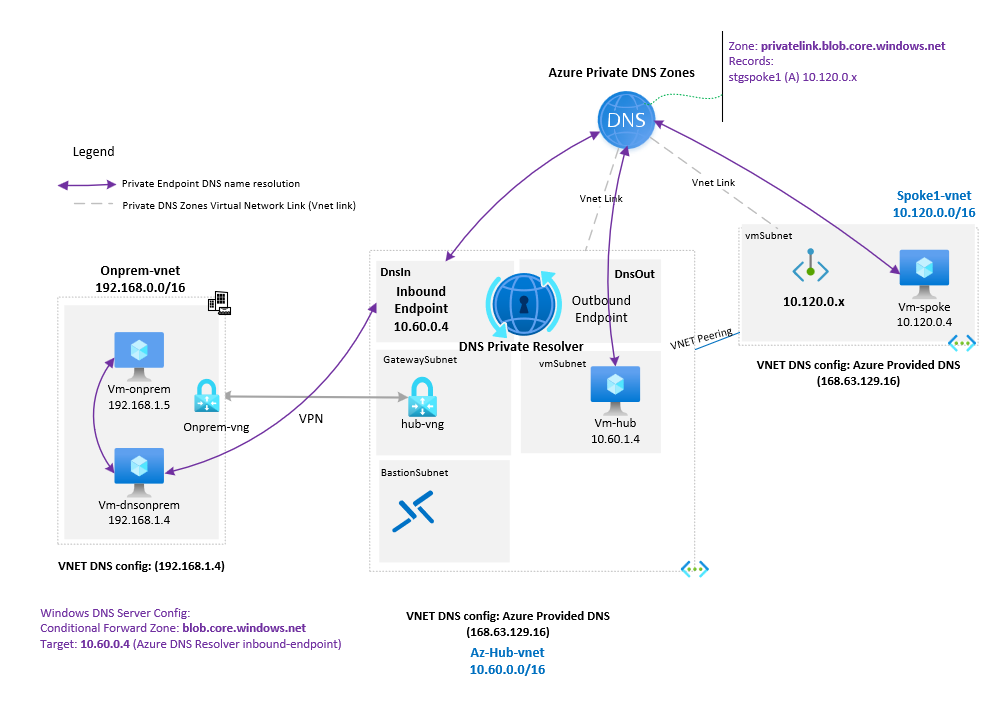
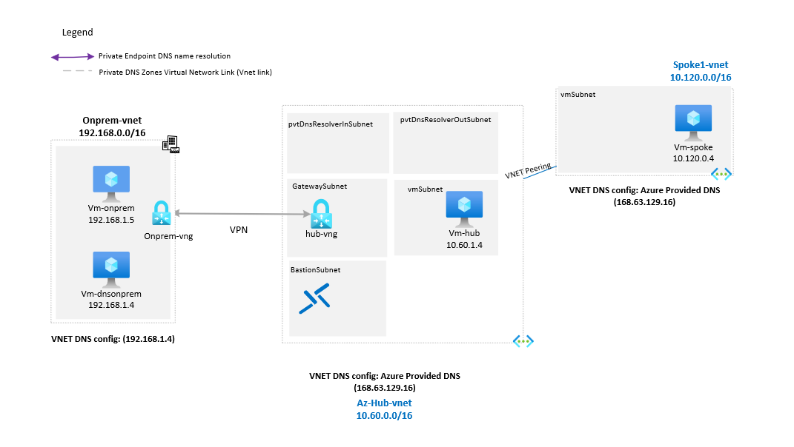

# Microhack DNS Resolver

### [Prerequisitos](#prerequisitos)

### [Reto 1: Crear una cuenta storage privada y acceder a traves de un private endpoint](#reto-1-crear-una-cuenta-storage-privada-y-acceder-a-traves-de-un-private-endpoint-1)

### [Reto 2: Configurar Private Dns Resolver y acceder a la cuenta de storage de manera privada](#Reto2)

# Prerequisitos

## General

El Proposito de este Microhack es demostrar el uso de [Azure DNS Private resolver](https://docs.microsoft.com/en-gb/azure/dns/dns-private-resolver-overview). 
La arquitectura de referencia hibrida para el manejo de DNS y private enpoints es de la siguiente manera

Para este escenario vamos a emular la parte on-premise con una vnet conectada a traves de una VPN.
Partiremos desde un escenario base para poder ir desplegando los diferentes componentes y ver las diferentes problematicas que ocurren

## Tarea 1: Desplegar las plantillas bicep 

Para desplegar el ambiente base utilizaremos bicep y va a ser deplegada en su subscripcion de azure en east us

- logearse a cloud shell (Powershell)

`Cd clouddrive`

- Clonar el repo 

`git clone https://github.com/mblanco77/dnsresolvermh.git`

- Ejecutar ./deploy.ps1

`cd ./dnsresolvermh/src/`

`./deploy.ps1`

- al final del despliegue se es presentado el paswword para ingresar a las VM 
- username:azureuser
- pass: {guid}

## Tarea 2: Verificar conectividad 
Conectarse via Bastion a las 3 maquinas y verificar conectividad

Desde vm-spoke1
`test-netconnection 192.168.1.4 -port 3389`

Desde vm-onprem
`test-netconnection 10.120.1.4 -port 3389`

# Reto 1: Crear una cuenta storage privada y acceder a traves de un private endpoint
- Crear una cuenta de storage sin endpoint publico
- Crear un private endpoint (Que se debe tener en cuenta?, en que vnet)
[https://learn.microsoft.com/en-us/azure/private-link/private-endpoint-dns]
- Private DNS ZONE (a que redes se debe conectar?)
- Verificar resolucion de nombres desde vm-spoke

# Reto 2: Configurar Private Dns Resolver y acceder a la cuenta de storage de manera privada
- Que problematica estamos resolviendo?
- Crear un private dns Resolver 
- Crear inbound endpoint
- Crear Conditional Forward Lookup Zone on-prem ()
- Verificar resolucion de nombres desde vm-onprem
- Crear dns zones contoso.com en vm-dnsonprem
- crear outbount endpoint 
- Verificar Resolucion hacian on-prem desde vm-spoke

